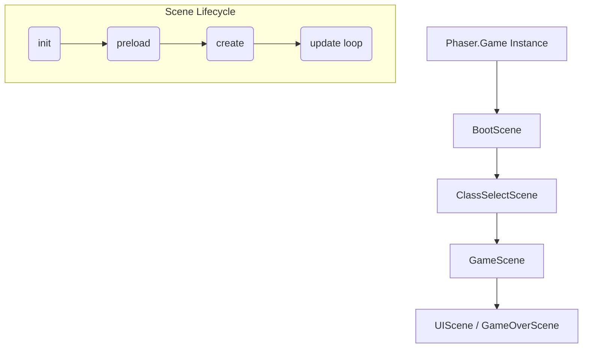
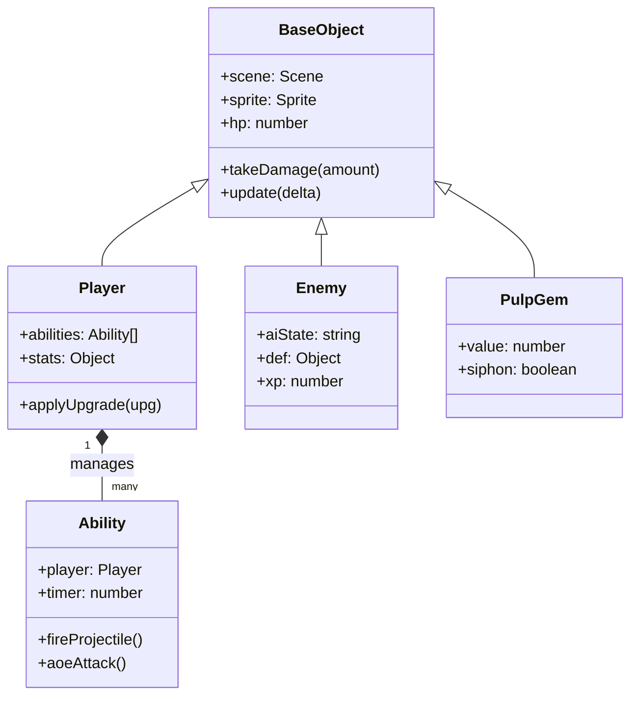
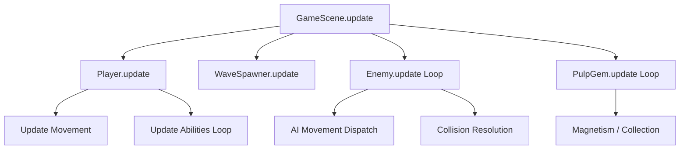

# Banana Survivors

Banana Survivors is a top-down survivor-style action game built with the Phaser 3 game engine. Players choose a unique banana-themed class, fight off waves of rotting enemies, collect pulp to level up, and unlock powerful abilities to survive as long as possible.

## How Phaser Works

Being a Phaser 3 project, the game follows a specific lifecycle for its scenes. Each scene manages its own assets, input, and physics.

- **init()**: Sets up initial data and scene variables.
- **preload()**: Loads external assets like images, audio, and JSON data.
- **create()**: Initializes game objects, physics groups, and input listeners.
- **update()**: Runs every frame (the "Game Loop").

## Project Structure

The project is organized into several JavaScript files, each handling a specific part of the game logic. This modular approach makes it easier to find and update specific features.

### index.html
This is the main entry point of the application. It sets up the basic web page structure, defines the CSS styles for the game container and loading screen, and initializes the Phaser game instance. It also determines the order in which scenes are loaded.

### config.js
This file contains the global settings and data for the game. If you want to change how fast the player moves, how much health an enemy has, or what upgrades are available, this is the place to look. It includes:
- Global configuration (screen size, spawn rates, difficulty scaling).
- Enemy definitions (stats, icons, movement patterns).
- Upgrade pool (the items you can pick when you level up).

### base.js
This file contains the BaseObject class, which serves as the foundation for almost everything that moves on the screen (players, enemies, projectiles). It handles common tasks like:
- Building and positioning sprites.
- Managing health bars.
- Taking damage and playing hit effects.
- Simple walk animations.
It also contains GameUtils, a collection of helpful functions for things like screen shaking, floating text, and spawning enemies.

### player.js
This file defines the Player class and the unique character classes available in the game (like the Alchemist or the Bruiser). It handles:
- Player-specific stats and movement.
- Managing the player's current abilities and upgrades.
- Leveling up and XP tracking.
- Class definitions, including their names, descriptions, and unlock conditions.

### enemies.js
This file manages everything related to the monsters chasing you. It contains:
- The Enemy class, which handles enemy AI (seeking players, zig-zagging, or orbiting).
- The WaveSpawner class, which decides when and where to spawn new enemies based on the current difficulty.
- The PulpGem class, which represents the experience points dropped by defeated enemies.

### scenes.js
Phaser games are divided into scenes. This file defines the different screens and states of the game:
- BootScene: Loads all images and sounds and generates procedural textures.
- ClassSelectScene: The menu where you choose your character and see your best scores.
- GameScene: The main gameplay loop where you fight and survive.
- UIScene: Handles the heads-up display (health bar, timer, kill count).
- GameOverScene: Shows your final stats after a run.

### abilities.js
This file contains the logic for all the different attacks and passive skills the player can use. Each ability is defined as a class that handles its own timing, damage, and visual effects.

### scene.fx.js
This file is dedicated to "juice" and visual polish. It handles full-screen effects like vignette, film grain, and chromatic aberration, as well as particle bursts for explosions, level-ups, and healing.

### ui.js
Contains specialized UI components like the virtual joystick for mobile play and the responsive bars used for health and experience.

### noise.js
A utility file for generating noise patterns, often used to create unique visual textures or randomized effects.

## Technical Architecture

Banana Survivors is designed with a modular, class-based architecture that leverages the Phaser 3 event system and component-like scenes.

### Class Hierarchy

The following diagram illustrates the core inheritance and relationship structure of the game's entities:

### Core Systems

#### 1. Entity System (`base.js`, `player.js`, `enemies.js`)
All gameplay objects inherit from `BaseObject`, which provides unified handling for:
- **Sprite Management**: Automatic texture fallback and procedural face drawing.
- **Health Management**: Unified `takeDamage` logic with hitflashes, knockback, and health bar updates.
- **Animations**: A non-frame-based procedural animation system (`rock`, `bounce`, `wiggle`) that breathes life into static icons.

#### 2. Ability System (`abilities.js`)
Abilities are self-contained classes that encapsulate logic for specific attacks. 
- **Decoupling**: The `Player` doesn't need to know how the "Acid Rain" works; it simply updates its ability list.
- **Shared Helpers**: The base `Ability` class provides robust methods for common geometry tasks like `fireProjectile` and `aoeAttack`.

#### 3. AI & Movement Patterns (`enemies.js`)
Enemy behavior is driven by a strategy pattern defined in `ENEMY_DEFS`. The `Enemy` class dispatches movement logic based on the `moveType` (e.g., `zigzag`, `circle`, `seek`) and handles state-based special attacks for boss/elite types (e.g., `lightning_chain`, `magma_slam`).

#### 4. Event-Driven UI (`ui.js`, `scenes.js`)
The `UIScene` and `GameScene` communicate primarily through a pub/sub model using Phaser's internal `EventEmitter`. 
- **Decoupling**: The `GameScene` emits `player_hp_changed` or `enemy_killed`.
- **Reactivity**: The UI listens for these events to update bars, counters, and level-up prompts without needing direct references to game loop internals.

#### 5. Difficulty Scaling (`enemies.js`)
The `WaveSpawner` uses a time-based intensity system. As time progresses:
- **Intensity Level**: Higher levels unlock more dangerous enemy types from `ENEMY_DEFS`.
- **Stat Multiplication**: Global stat multipliers are applied to newly spawned enemies to keep pace with the player's power-ups.

#### 6. Game Loop Execution
The core gameplay cycle is driven by the `GameScene.update` method, which orchestrates the state of all entities.

### Data-Driven Design
The game's "Source of Truth" is `config.js`. By modifying these central objects, you can rebalance the entire game without touching a single line of logic:
- `ENEMY_DEFS`: Controls every monster's stats, AI, and visuals.
- `CLASS_DEFS`: Defines player archetypes and their starting ability pools.
- `UPGRADE_POOL`: Governs the progression path and stat growth during a run.

## How to Contribute

We welcome contributions from everyone! To keep the documentation organized, we have moved the full contribution guidelines, including how to add new enemies, classes, and abilities, to a separate file.

Please see [CONTRIBUTING.md](file:///c:/Users/hmmm/banana_survivors/CONTRIBUTING.md) for details on how to help improve Banana Survivors.

## Running the Project Locally

The project uses a simple local server to run. You can use any static file server (like the "serve" npm package) to host the directory and open index.html in your browser. Since it uses standard web technologies, there are no complex build steps required for basic development.
