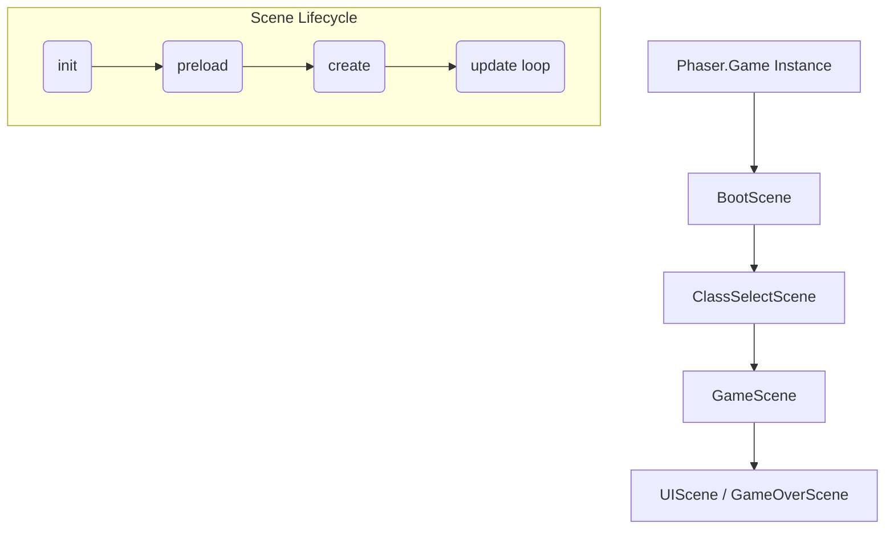
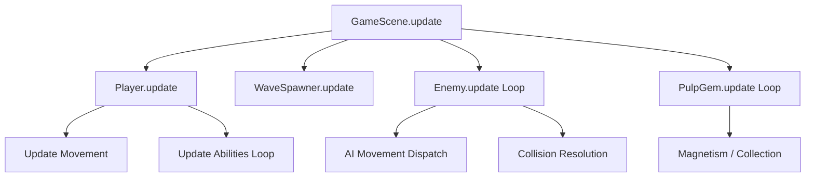

# Documentation Improvements Walkthrough

I have enhanced the project's documentation by adding technical diagrams, gameplay visuals, and organizing the contribution guidelines.

## Changes Made

### README.md
- **How Phaser Works**: Added a new section near the top explaining the Phaser 3 scene lifecycle with a Mermaid diagram.
- **Visuals**: Embedded [gameplay/loading.png](file:///c:/Users/hmmm/banana_survivors/gameplay/loading.png) and [gameplay/gameplay.png](file:///c:/Users/hmmm/banana_survivors/gameplay/gameplay.png) to give users an immediate visual overview of the game.
- **Game Loop**: Added a "Game Loop Execution" section under Technical Architecture, featuring a flowchart of the [update()](file:///c:/Users/hmmm/banana_survivors/abilities.js#198-230) cycle.
- **Contribution Link**: Replaced the inline contribution guide with a clear link to the new [CONTRIBUTING.md](file:///c:/Users/hmmm/banana_survivors/CONTRIBUTING.md).

### CONTRIBUTING.md
- Created a dedicated file for contributors.
- Included detailed instructions for adding enemies, classes, and abilities.
- Added sections on visual polish and code style.

## Proof of Work

### Diagrams

#### Phaser Lifecycle

#### Game Loop Flow

### New Files
- [CONTRIBUTING.md](file:///c:/Users/hmmm/banana_survivors/CONTRIBUTING.md)
